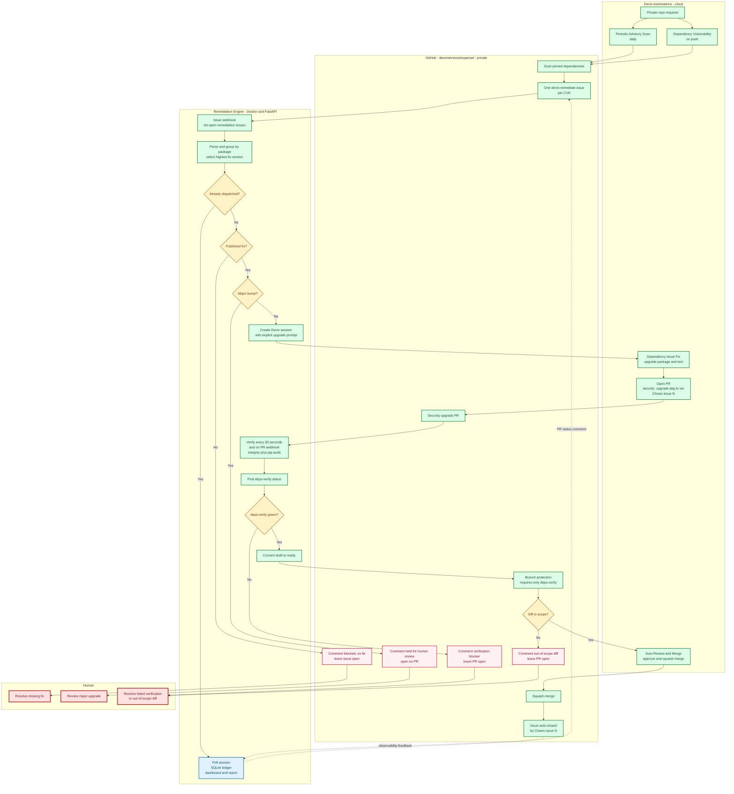

# The fully-automated remediation loop

Generated with the Codex CLI (`omc ask codex`), gpt-5.5. Renders natively on GitHub.

**Happy path (green, fully automated):** detect → dispatch → fix → verify → gate → merge → issue closed.
**Guard exits (the only times a human is touched):** no published fix, major-version bump, or an out-of-scope diff / failed `deps-verify`.

**Legend** — 🟩 green = automated step · 🟨 amber diamond = decision guard · 🟥 red = human hand-off · 🟦 blue = observability.
