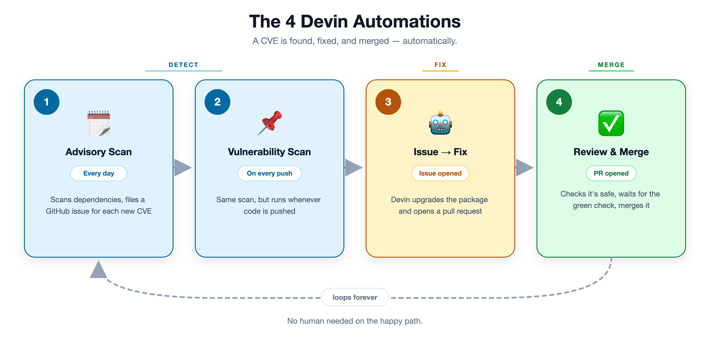

# Devin Dependency Remediation Engine

An event-driven automation that turns dependency-vulnerability issues into
reviewed-ready pull requests, using [Devin](https://devin.ai) as the agent
that does the actual upgrade-and-PR work. Built against
[`deonmenezes/superset`](https://github.com/deonmenezes/superset), a fork of
Apache Superset seeded with real CVEs found in its pinned dependencies.

> 🎤 **Pitch deck** (What / How / Why / When): **[`pitch.pdf`](pitch.pdf)** · **[`pitch.pptx`](pitch.pptx)** · source [`pitch.html`](pitch.html).

## The problem

A scheduled scanner (or Dependabot, or any SCA tool) files a GitHub issue
every time it finds a vulnerable pinned dependency. On a repo of any size
that turns into a steady drip of issues that someone has to triage, bump,
test, and PR - one at a time, forever. This project is the "someone": it
watches for those issues, groups them by package (so a package with five
open CVEs gets upgraded once, not five times), and hands each group to a
Devin session with explicit instructions and guardrails. It reports back
what happened so an engineering lead can see throughput and success rate
without reading every PR.

## Architecture - the full loop

```
  ┌─ STAGE 1 (Devin Automation) ────────────────────────────────┐
  │  Scheduled/push scan → files one `devin-remediate` issue per │
  │  CVE. Detection only, never opens a PR.                      │
  └──────────────────────────────┬──────────────────────────────┘
                                  ▼  (GitHub issues)
GitHub issue opened/labeled  ──┐
GitHub push                  ──┼─▶  POST /webhook/github  ──┐
Simulate-webhook button      ──┤    POST /simulate-webhook  │   ← STAGE 2 (this service)
Trigger-dispatch button      ──┘    POST /trigger           │
                                                              ▼
                                                       Orchestrator
                                            (app/orchestrator.py)
                                   1. list open `devin-remediate` issues
                                   2. parse + group by package, pick the
                                      highest fix version per package
                                   3. skip packages already dispatched
                                   4. for packages with a published fix:
                                        Devin v3 create_session(prompt)   ← STAGE 3 (Devin session
                                      for packages with none:                opens the PR)
                                        comment the blocker, no session
                                                              │
                                                              ▼
                                                   SQLite run ledger
                                                    (app/store.py)
                                                              │
                              background poll job ───────────┤
                              (apscheduler, every 30s)        │
                              checks running sessions,        │
                              records PR URL + ACU spent,     │
                              comments back on the issue(s)   │
                                                              ▼
                                          GET /status (JSON) · GET /dashboard (HTML)

  ┌─ deps-verify gate (this engine, every 30s) ─────────────────┐
  │  Open dependency PR → validate requirements integrity +      │
  │  pip-audit → POST commit status `deps-verify` = success.     │
  │  Branch protection requires it, so the PR becomes mergeable. │
  └──────────────────────────────┬──────────────────────────────┘
                                  ▼
  ┌─ STAGE 4 (Devin Automation) ────────────────────────────────┐
  │  PR opened (title "security: upgrade…") → check diff scope + │
  │  `deps-verify` green → approve & squash-merge, else comment. │
  └─────────────────────────────────────────────────────────────┘
```

Stages 1 and 4 are no-code **Devin Automations** configured in the Devin app;
stages 2-3 (and the deps-verify gate) are this Dockerized service. Together they
close the loop from "CVE disclosed" to "fix merged" with a human only in the loop
when something looks unsafe.

> 📈 A rendered, color-coded flowchart of the full loop - including every guard
> and the human hand-offs - is in **[`LOOP.md`](LOOP.md)** (Mermaid, renders on
> GitHub) with a PNG export at [`loop.png`](loop.png).

### The four automations, at a glance



*(Simple one-slide version - source SVG: [`four-automations.svg`](four-automations.svg).)*

Key files:

| File | Responsibility |
|---|---|
| `app/main.py` | FastAPI app: webhook receiver, manual trigger, status/dashboard endpoints, schedules the poll loop |
| `app/orchestrator.py` | Issue parsing, package grouping, prompt construction, dispatch + poll logic |
| `app/devin_client.py` | Thin wrapper around the Devin v3 sessions API |
| `app/github_client.py` | Thin wrapper around the GitHub REST API (list issues, comment) |
| `app/store.py` | SQLite-backed ledger of every dispatch - the data behind `/status` and `/dashboard` |
| `scripts/simulate_webhook.py` | Fires a correctly-signed synthetic GitHub webhook at a local instance, so the event path can be demoed without a public tunnel |

## The merge gate - CI on a billing-blocked private fork

The fork **must stay private**: Devin's GitHub automations only fire on private
repos ([Devin docs](https://docs.devin.ai/product-guides/automations) - *"GitHub
automations only work with private repositories for security reasons"*). But on a
private repo GitHub Actions consumes paid minutes, and this account's Actions
billing is blocked - so **every** job in upstream Superset's 84-check matrix fails
before it even starts. That's the real reason a human previously had to
`--admin`-merge each fix over a wall of red.

Rather than pay for CI or expose the repo, **the engine is the CI.** A scheduler
job (`reconcile_checks`, every 30s - also fired by the `pull_request` webhook)
runs `deps-verify` over each open dependency PR:

1. Fetch the changed `requirements/*.txt` at the PR head.
2. Verify every requirement parses and every direct dependency is exactly pinned.
3. Run `pip-audit` for an advisory signal.
4. `POST /statuses/{sha}` with context **`deps-verify`** = `success` / `failure`.
5. If green and the PR is a draft, flip it to ready-for-review (drafts can't merge).

`master` branch protection **requires only the `deps-verify` context** (bound to
`app_id: -1` so the engine's status - not GitHub Actions - satisfies it). This is
the exact mechanism external CI (CircleCI, Jenkins, Buildkite) uses: a first-class
commit status gating merges. The upstream cloud-dependent workflows are disabled
on the fork, so a dependency PR shows one meaningful check - green `deps-verify`.

**The engine also closes the loop itself.** Once `deps-verify` is green on a
`security: upgrade` PR whose diff is in-scope (only `requirements/*.txt`) and
non-major, the reconcile job squash-merges it (`ENGINE_AUTO_MERGE`, on by
default) - so the full loop is autonomous in code we control, not dependent on
the no-code Stage-4 Devin automation (which the API can't inspect or toggle).
That automation stays configured as a belt-and-suspenders backup; whichever
merges first wins, and the other just sees an already-merged PR. See
[`DEVIN_AUTOMATIONS.md`](DEVIN_AUTOMATIONS.md) for the automation prompts.

> To use real GitHub-hosted Actions instead, unblock the account's Actions
> spending at github.com/settings/billing and re-enable `deps-verify.yml`
> (kept in the fork as documentation); the private-repo free tier covers the
> ~1-minute job. A self-hosted runner on any always-on box is the free
> alternative. Either way the gate name and branch protection are unchanged.

## The major-version guard

An upgrade that crosses a major version (e.g. **flask 2.3.3 → 3.1.3**) can carry
breaking API changes, so the loop never auto-remediates or auto-merges it:
`orchestrator.is_major_bump()` holds it, comments *"held for human review"* on the
issue, and opens no PR. Patch/minor security bumps flow through untouched. This is
what keeps the one genuinely risky open issue (flask, #60) from being silently
migrated and merged by an over-eager automation.

## Why group by package instead of fixing issues one at a time?

Two issues that both say "upgrade starlette" but cite different CVEs should
become **one** PR, not two competing PRs editing the same line of
`requirements/base.txt`. The orchestrator collapses all open issues for a
package into a single remediation unit, takes the highest fix version among
them, and asks Devin to close every issue in that group from one PR.

## Why a dry-run mode?

`DRY_RUN=true` (the default) runs the full pipeline - fetch issues, parse,
group, decide what *would* be dispatched - without calling the Devin API,
opening a session, or commenting on GitHub. That's what `/plan` always shows
you, and what `/trigger` does when dry-run is on. Flip `DRY_RUN=false` only
after you've reviewed the plan, since live dispatch spends real ACU and opens
real pull requests.

## Running it

```bash
cp .env.example .env
# fill in DEVIN_API_KEY, DEVIN_ORG_ID, GITHUB_TOKEN - never commit this file

docker compose up --build
```

The service comes up on `http://localhost:8000` and redirects `/` straight to
the dashboard.

### The dashboard is the whole demo - no terminal required

Open **`http://localhost:8000/dashboard`**. It's a self-service "control room"
with a pipeline diagram, a step-by-step guide, and every action wired to a
working button:

| Button | Endpoint | What it does |
|---|---|---|
| **Trigger dispatch** | `POST /trigger?limit=N` | Group the open issues and dispatch remediation for the top N packages |
| **Simulate webhook** | `POST /simulate-webhook` | Fire a correctly HMAC-signed `issues.opened` event at `/webhook/github` - proves the event-driven path (signature check included) with no public tunnel |
| **Poll sessions** | `POST /poll` | Refresh in-flight Devin sessions, pull back PR links + ACU |
| **Refresh** | - | Re-fetch every table now (also auto-refreshes every 8s) |
| **Generate report** | `GET /report` | Open a shareable executive report (also `/report.md` and `/report.json`) |
| **Reset** | `POST /reset` | Clear the run ledger so you can demo again from a clean slate |

The page also lists the raw open issues (linked to GitHub, with severity), the
package groups they collapse into, the live run ledger, and the four Devin
Automations (linked into the Devin app). An autonomy strip at the top shows the
loop is self-dispatching and counts down to the next scan.

Other endpoints, for scripting: `GET /healthz`, `GET /autonomy` (is the loop
self-running, and when does it scan next), `GET /plan` (read-only preview),
`GET /status` (JSON), `GET /automations`, `POST /webhook/github` (the real
webhook target).

### Autonomous mode (no webhook, no clicks)

Out of the box the engine runs itself: a background rescan job re-reads the
backlog every `RESCAN_INTERVAL_SECONDS` (default 120s) and dispatches any new,
fixable package group, and `DISPATCH_ON_STARTUP` fires one pass ~8s after boot
so it acts immediately. So the full path - **issue filed → engine dispatches
Devin → Devin opens the PR → `deps-verify` goes green → Devin automation merges**
- closes with no human and no public tunnel. The dashboard's autonomy strip
shows the loop is live and counts down to the next scan; `GET /autonomy`
exposes the same state as JSON. Set `RESCAN_INTERVAL_SECONDS=0` to revert to
webhook/manual-only dispatch. Safety caps still apply: `DISPATCH_LIMIT_PER_RUN`
per pass, `MAX_ACU_PER_SESSION` per session, major bumps and no-fix packages
held automatically.

### Wiring a real GitHub webhook

The `⚡ Simulate GitHub webhook` button (or `scripts/simulate_webhook.py`) sends
the exact signed payload GitHub would. To use a real webhook, point a GitHub
webhook at this service's `/webhook/github` (via an ngrok tunnel during a demo,
or a deployed instance) and set the same `GITHUB_WEBHOOK_SECRET` on both sides.

### Working through the existing issue backlog

Seed issues filed by a scheduled scan *before* this service existed won't
retroactively fire a webhook. The autonomous rescan (on by default) picks up
that backlog on its next pass regardless of issue age - it only cares whether a
package has already been dispatched. `POST /trigger` does the same on demand.

## Observability

`/dashboard` is the answer to "how do I know this is working": total runs,
a live breakdown by status (`running` / `fixed` / `blocked` / `skipped_no_fix`
/ `error`), cumulative ACU spent, and per-package PR links. `/status` exposes
the same data as JSON for scripting or piping into a real metrics stack.

For a leadership-facing snapshot, **`/report`** renders a standalone executive
summary - open CVE backlog, package groups, runs dispatched, PRs opened, issues
closed, ACU consumed, and success rate - with one-click export to Markdown
(`/report.md`, paste into Slack/email/a ticket), JSON (`/report.json`, for a BI
pipeline), or print-to-PDF. It's the "would an engineering leader be able to
tell this is working?" deliverable in one page.

### Verbal briefing - get a phone call that reads the report aloud

`/report` also has a **"Call me now"** control that places an outbound phone
call and speaks the current status (open CVEs, PRs opened, issues closed, and
anything blocked) - for a leader who'd rather listen than read. It's ported
from a Twilio voice integration: the report is turned into a short spoken
script (written by Claude when `ANTHROPIC_API_KEY` is set, otherwise a
deterministic template), wrapped in inline TwiML, and handed to the Twilio
Calls API - no public webhook needed, so it works from localhost. Set
`TWILIO_ACCOUNT_SID`, `TWILIO_AUTH_TOKEN`, and `TWILIO_FROM_NUMBER` to enable
it; `GET /voice-status` reports whether it's wired.

## Security notes

- Secrets are read from environment variables only; nothing is hardcoded or
  logged. `.env` is gitignored.
- The webhook endpoint verifies GitHub's `X-Hub-Signature-256` HMAC before
  acting on a payload.
- Devin sessions are capped per-session via `MAX_ACU_PER_SESSION`, and dispatch
  is capped per-trigger via `DISPATCH_LIMIT_PER_RUN`, so a single event can't
  fan out into unbounded spend.
- A package with no published fix never gets force-pushed into a broken PR -
  the agent is explicitly instructed to comment the blocker and stop instead.
- A major-version upgrade is never auto-remediated or auto-merged; it's held for
  a human (see "The major-version guard"). Merges are gated by branch protection
  on the required `deps-verify` check, so nothing lands un-verified.

## Extending this for a real customer engagement

- Multi-repo / multi-ecosystem: today this assumes one repo and pip-style
  requirements files; the grouping and prompt-building logic generalizes
  to npm/cargo/go.mod with a different issue-title parser per ecosystem.
- Notify a Slack channel on `fixed`/`blocked` instead of (or in addition to)
  GitHub comments.
- ~~Auto-merge on green CI + an approving review~~ **(done)** - the `deps-verify`
  gate + branch protection + the Stage-4 Devin automation now merge green,
  in-scope, non-major PRs with no human. See "The merge gate" above.
- Replace the SQLite ledger with Postgres and the dashboard with a real
  metrics backend (Grafana/Datadog) once run volume justifies it.
- Add a severity-aware SLA: page someone if a `critical` advisory's package
  group hasn't reached `fixed` within N hours.
